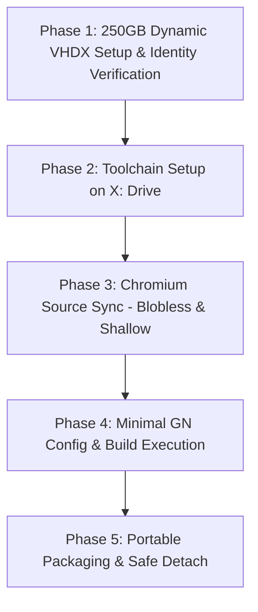

# [PROJECT]: Lite Chromium Portable
# [WORKSPACE ROOT]: E:\vivpr\ai\ebrowser
# [BOUND THREAD]: goodkie/v-show Issue #8
# [ISOLATION SANITY CHECK]: VERIFIED (Zero cross-project contamination)

# P2-250GB Chromium Build Environment Execution Plan

## 1. Executive Summary & Gate Status

- **Current Gate Status:** **PLANNING ONLY (No live 250GB VHDX creation, No VS/SDK installation, No file deletion)**.
- **1GB Live Verification Milestone:** Formally ACCEPTED by ChatGPT ([`[CHATGPT][AUDIT ACCEPTED / NEXT PREPARATION][P2-1GB-LIVE-02]`](https://github.com/goodkie/v-show/issues/8#issuecomment-5994593963)).
- **Preserved Backing Files & Logs:**
  - R1 VHDX: `E:\vivpr\ai\ebrowser\build_test_1gb.vhdx` (4,194,304 bytes, Attached=False) preserved.
  - R1 Log: `tests/1gb_live_test_raw_transcript.txt` preserved.
  - R2 Attempt 1 Log: `tests/1gb_live_test_r2_attempt1_failed_transcript.txt` preserved.
  - R2 Attempt 2 Log: `tests/1gb_live_test_r2_raw_transcript.txt` (All Steps PASS) preserved.
  - R2 VHDX: `E:\vivpr\ai\ebrowser\build_test_1gb_r2.vhdx` (138,412,032 bytes, Attached=False) preserved.
- **Objective:** Establish a fully portable, isolated Chromium build environment using an expandable 250GB VHDX mounted as `X:\`, with minimal footprint on the host `C:\` drive (< 6.5 GB consumption), dedicated solely to compiling Lite Chromium Portable.

---

## 2. 1GB Live Test Evidence Clarification & Fact-Based History

In response to ChatGPT review audit items:

1. **Runner Self-Blob Reporting Clarification**:
   - The R2 runner (`tests/run_1gb_live_test_r2.ps1`) verifies the exact blob hashes of the build executor (`build/setup_build_volume.ps1` -> `6e216cb6588bd1e79c514e2dbc9d01b844cf02c7`) and safety module (`build/VirtualDiskSafety.psm1` -> `47bfc232bb722919b65e0fb46325e8584e3e96b3`) against baseline commit `2165873b38afda5f23678aa150c793c8d6507262`.
   - The runner does not compute its own blob hash at runtime within the transcript; rather, the runner's own blob integrity (`3e94c5dd75632eeb41d6b27ec26a7434708f9fc9`) is independently audited and tracked via git tree/index objects.
2. **Attempt 1 vs. Attempt 2 Sequence & Environmental Realities**:
   - **Attempt 1 (06:24:52 ~ 06:25:14 EDT)**:
     - Executed by Owner via `run_1gb_test_r2.bat` (Run as Administrator) prior to ChatGPT's test evidence correction feedback.
     - DiskPart failed to create the virtual disk file during Step 1; subsequent `Get-DiskImage` threw `ObjectNotFound (0x80070002)`.
     - The runner's exception handler caught the failure cleanly, observed `VHDX File Status: NOT FOUND`, `Image Attached Status: UNKNOWN`, `Drive X: Status: FREE / UNMOUNTED`, and exited with code 1 without mutating host drives.
     - Note on DiskPart Exit Codes: DiskPart process exited with code 0 despite not creating the file. This confirms that **structured Windows/CIM object observation (`Get-DiskImage`, `Get-CimInstance MSFT_Disk`, `Get-PSDrive`) must remain the sole authoritative arbiter of disk state**.
     - Raw log was preserved and committed as `tests/1gb_live_test_r2_attempt1_failed_transcript.txt` (commit `eb3debe7fb3bc3242594ffd6bdcb5034ff0dec75`).
   - **Attempt 2 / Controlled Live Retry (07:04:42 ~ 07:05:39 EDT)**:
     - Executed by Owner via `run_1gb_test_r2.bat` (Run as Administrator) following ChatGPT's gate pass ([`[CHATGPT][TECHNICAL GATE PASS / EXECUTE ONE CONTROLLED RETRY]`](https://github.com/goodkie/v-show/issues/8#issuecomment-5992928810)).
     - Full structured pass: Disk 2 verified clean RAW (BusType=15, UniqueId `6002248097D0EFCB4BD0DB1B9FA89EE7`), pre-format reverified, GPT initialized, NTFS formatted (label `CHROMIUM_BUILD`), X: letter mapped, volume correspondence verified, Nonce byte-for-byte read/write verified, clean detach observed (`Attached=False`, `Drive X: FREE`), and VHDX preserved at 138,412,032 bytes.
     - Runner output: `=== 1GB LIVE TEST COMPLETE: ALL STEPS VERIFIED PASS ===`.
3. **Outer Runner Exit Code Status**:
   - Because the outer command prompt window was closed by the user upon completion, the external process exit code is formally cataloged as **UNKNOWN (Transcript verified PASS by structured observation)**.

---

## 3. Host Drive Measurements & Capacity Planning

### 3.1 Read-Only Drive Space Measurements (2026-10-05 09:08 EDT)
Measurements obtained via Windows PowerShell `Get-Volume`:

| Drive | FileSystem | Total Size | Free Space (GB) | Free Space Ratio | Role |
| :--- | :--- | :--- | :--- | :--- | :--- |
| **`C:`** | **NTFS** | **464.97 GB** | **34.70 GB** | **7.46%** | Host OS, User Profile, Essential MSI Runtimes |
| **`E:`** | **exFAT** | **4,657.11 GB** | **527.27 GB** | **11.32%** | Workspace Root, Backing Storage for VHDX files |

### 3.2 250GB Dynamic VHDX Allocation & Remaining Margin
- **Backing VHDX Target Path:** `E:\vivpr\ai\ebrowser\build_volume_250gb.vhdx`
- **VHDX Format:** Expandable (Dynamic)
- **Maximum Allocated Logical Size:** **256,000 MB (250.00 GB)**
- **Initial Physical Allocation on E:**: ~138 MB
- **Projected Free Space on E: at Maximum Expansion:**
  $$\text{Free Space}_{\text{post-max}} = 527.27\text{ GB} - 250.00\text{ GB} = \mathbf{277.27\text{ GB}}$$
- **Safety Margin:** Even if the VHDX file expands to its full 250 GB capacity, E: drive maintains **277.27 GB of free space** (> 52% free capacity retained).

---

## 4. Chromium Sizing Analysis & 250GB Adequacy

Building modern Chromium requires substantial disk space for source files, hermetic toolchains, object files, and intermediate linker outputs. Below is the itemized budget for a headless / minimal portable Chromium build:

| Component | Estimated Size | Storage Location | Notes / Optimization |
| :--- | :--- | :--- | :--- |
| **`depot_tools`** | ~1.5 GB | `X:\depot_tools\` | Ninja, GN, Python, CIPD packages |
| **VS Build Tools & Win11 SDK** | ~12.0 GB | `X:\toolchain\` | Redirected via `--installPath` & `--downloadCache` |
| **Chromium Source Code (`src/`)** | ~35.0 – 42.0 GB | `X:\chromium\src\` | Shallow blobless clone (`--no-history`, `--depth=1`) |
| **Prebuilt Toolchains & Hooks** | ~15.0 – 20.0 GB | `X:\chromium\src\third_party\` | Clang/LLVM, Node, Java, Windows sysroots |
| **Intermediate Object Files (`.obj`)**| ~30.0 – 40.0 GB | `X:\chromium\src\out\Default\` | Compiled with `symbol_level=0`, `is_debug=false` |
| **Final Binaries & Installer** | ~2.5 – 4.0 GB | `X:\chromium\src\out\Default\` | `mini_installer.exe`, `chrome.exe`, `chrome.dll` |
| **Build Cache / Temp Buffer** | ~25.0 – 35.0 GB | `X:\temp\` / `X:\cache\` | Linker scratch space, PDB scratch buffers |
| **Total Estimated Footprint** | **~121.0 – 154.5 GB** | **Volume `X:\`** | **Total capacity: 250.0 GB** |
| **Remaining Free Space Buffer** | **~95.5 – 129.0 GB** | **Volume `X:\`** | **Buffer Margin: ~38% – 51% free** |

**Adequacy Assessment:**
250 GB provides a **100 GB+ safety cushion** provided that:
1. Git history is omitted during checkout (`--no-history` / shallow sync).
2. Debug symbols are disabled (`symbol_level = 0`, `blink_symbol_level = 0`).
3. Build is configured as Release (`is_debug = false`).

---

## 5. C: Drive Constraint & Toolchain Redirection Strategy

### 5.1 The C: Drive Challenge
- C: currently has **34.70 GB** free.
- Default Visual Studio installation places packages in `C:\ProgramData\Package Cache`, shared components in `C:\Program Files (x86)\Microsoft Visual Studio\Shared`, and toolchains in `C:\Program Files\Microsoft Visual Studio\2022`, easily consuming 25–35 GB and risking system partition exhaustion.

### 5.2 Strict Redirection to X:
To guarantee that C: consumption remains strictly below **6.5 GB**, Visual Studio 2022 Build Tools will be installed using command-line redirection flags:

```cmd
vs_BuildTools.exe --quiet --wait --norestart --nocache ^
  --installPath "X:\toolchain\vs2022" ^
  --downloadCache "X:\toolchain\vs_cache" ^
  --sharedInstallationPath "X:\toolchain\vs_shared" ^
  --add Microsoft.VisualStudio.Workload.VCTools ^
  --add Microsoft.VisualStudio.Component.VC.Tools.x86.x64 ^
  --add Microsoft.VisualStudio.Component.Windows11SDK.22621
```

### 5.3 Projected C: Drive Consumption Breakdown

| Subsystem | Target Drive | Projected C: Consumption | Notes |
| :--- | :--- | :--- | :--- |
| VS Installer Core & Global Manifests | C: (Fixed by MS) | ~2.5 GB | `C:\Program Files (x86)\Microsoft Visual Studio\Installer` |
| Windows SDK CRT & Shared MSI Registrations | C: (Fixed by MS) | ~2.0 GB | Side-by-side CRT runtimes, Windows Kits metadata |
| MSVC Compilers, Linkers, Headers | `X:\toolchain\vs2022` | **0.0 GB** | Redirected to X: |
| Package Download & Install Cache | `X:\toolchain\vs_cache` | **0.0 GB** | Redirected to X: |
| SDK Core Tools, Debuggers, Libs | `X:\toolchain\vs_shared` | **0.0 GB** | Redirected to X: |
| Chromium Source & Build Artifacts | `X:\chromium` | **0.0 GB** | Fully on X: |
| **Total Host C: Drive Consumption** | — | **~4.5 – 6.5 GB** | **Within 34.70 GB C: capacity** |
| **Projected C: Free Space Remaining** | — | **~28.20 – 30.20 GB** | **Safe Operating Margin Retained** |

---

## 6. Phased Implementation Roadmap



### Phase 1: 250GB Dynamic VHDX Setup & Identity Verification
- **Executor:** `portable-minimal/build/setup_build_volume.ps1`
- **Parameters:** `-VhdPath "E:\vivpr\ai\ebrowser\build_volume_250gb.vhdx" -SizeMB 256000 -DriveLetter X -Execute`
- **Rigorous Verifications:**
  1. `Test-AttachedVirtualDiskIdentity`: BusType == 15, IsSystem == False, IsBoot == False, PartitionStyle == 0 (RAW), NumberOfPartitions == 0.
  2. `Test-PreFormatIdentityMatch`: Pre-format reverification of Number, UniqueId, and Path.
  3. `Test-TargetVolumeCorrespondence`: X: corresponds strictly to the verified Disk Number.
  4. Nonce I/O byte-for-byte read/write test with guaranteed deletion.

### Phase 2: Toolchain & depot_tools Setup on X:
1. Create directory structure on X:
   - `X:\toolchain`
   - `X:\depot_tools`
   - `X:\chromium`
   - `X:\temp`
2. Download and extract `depot_tools` to `X:\depot_tools`.
3. Execute redirected VS Build Tools installation (Section 5.2).
4. Configure session environment:
   ```powershell
   $env:PATH = "X:\depot_tools;$env:PATH"
   $env:DEPOT_TOOLS_WIN_TOOLCHAIN = 0
   $env:vs2022_install = "X:\toolchain\vs2022"
   $env:WINDOWSSDKDIR = "X:\toolchain\vs_shared\Windows Kits\10"
   $env:TEMP = "X:\temp"
   $env:TMP = "X:\temp"
   ```

### Phase 3: Chromium Source Code Synchronization
- Navigate to `X:\chromium`.
- Execute blobless / shallow fetch:
  ```cmd
  fetch --no-history --no-hooks chromium
  ```
- Run gclient hooks to synchronize essential build dependencies:
  ```cmd
  gclient runhooks
  ```

### Phase 4: Minimal GN Build Configuration
- Generate build directory `X:\chromium\src\out\Default`:
  ```cmd
  gn gen out\Default --args="is_debug=false is_component_build=false symbol_level=0 blink_symbol_level=0 target_cpu=\"x64\" enable_nacl=false proprietary_codecs=false"
  ```
- Compile minimal target:
  ```cmd
  autoninja -C out\Default chrome
  ```

### Phase 5: Portable Packaging & Safe Detach
- Copy compiled `chrome.exe`, `chrome.dll`, and required resource files into portable workspace package `E:\vivpr\ai\ebrowser\portable-minimal\dist\`.
- Execute Controlled Safe Detach of 250GB VHDX (Section 7).

---

## 7. Mounting, Observation & Safe Detach Operations

### 7.1 Mounting & Pre-Flight Reverification
To remount the existing 250GB build volume in subsequent sessions without reformatting:
```powershell
# Elevated Administrator PowerShell
powershell -NoProfile -ExecutionPolicy Bypass -File "E:\vivpr\ai\ebrowser\portable-minimal\build\setup_build_volume.ps1" -VhdPath "E:\vivpr\ai\ebrowser\build_volume_250gb.vhdx" -DriveLetter X -Execute
```

### 7.2 Controlled Safe Detach Procedure
When build activities conclude or if execution is paused:
```powershell
# Elevated Administrator PowerShell
powershell -NoProfile -ExecutionPolicy Bypass -File "E:\vivpr\ai\ebrowser\portable-minimal\build\setup_build_volume.ps1" -VhdPath "E:\vivpr\ai\ebrowser\build_volume_250gb.vhdx" -DriveLetter X -DetachOnly -Execute
```
**Safety Assertions enforced during Detach:**
1. Verify no active compiler / ninja processes lock files on `X:\`.
2. Issue DiskPart detach: `select vdisk file="..."; detach vdisk`.
3. Re-query `Get-DiskImage` to verify `Attached == False`.
4. Re-query `Get-PSDrive` to verify `X:` is completely unmounted.
5. Backing file `build_volume_250gb.vhdx` preserved intact on E: without deletion.

---

## 8. Explicit User Approvals Required (Gate Inventory)

Before any commands in this plan are executed, the following explicit Owner approvals must be formally recorded:

1. **Gate Approval 1 (Disk Allocation):**
   - Permission to create `E:\vivpr\ai\ebrowser\build_volume_250gb.vhdx` (Expandable VHDX, Max 250 GB).
2. **Gate Approval 2 (Host C: Drive MSI / Toolchain Footprint):**
   - Permission to install Visual Studio 2022 Build Tools (CLI) with redirection to `X:\`, consuming estimated **~4.5 to 6.5 GB** on host `C:\` drive.
3. **Gate Approval 3 (Network Download Quota):**
   - Permission to download ~35–45 GB of Chromium source code and ~15–20 GB of prebuilt toolchains over network to `X:\`.

---
*End of Plan. Awaiting ChatGPT review and Owner formal gate approvals before proceeding.*
